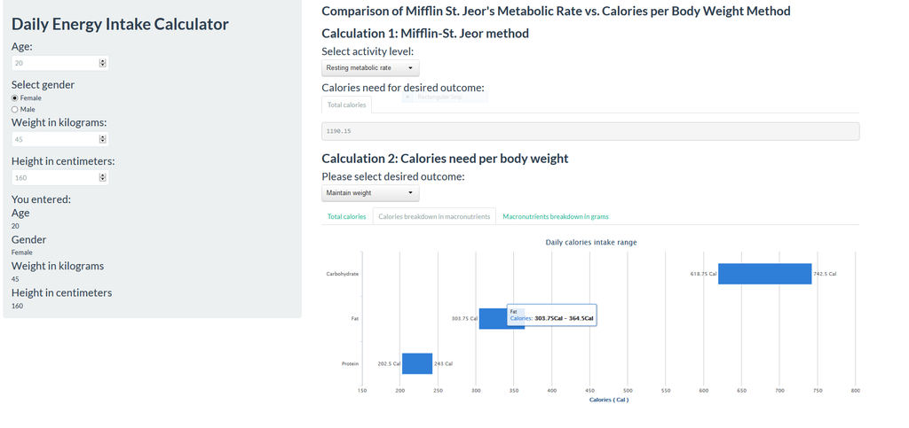

## Yet another app? for what?

- Healthy lifestyle begs for being aware of daily calories intake
- Methods for determining energy needs: 
	- indirect calorimetry (equipment based) 
	- predictive equations (Harris-Benedict, Mifflin-St.Jeor)
	- quick and dirty method (calories per body weight)
- Harris-Benedict usally overestimates needs (27% of times), while Mifflin-St.Jeor predicts better
- calories per body weight method developed for time sensitive clinical settings 
- myCalories application:
	- asks users to input age, gender, weight in kg, and height in cm   
	- compares Miflin-St.Jeor vs. calories per body weight equations
	- displays macronutrients breakdown in calories and grams
  

--- 

## Mifflin-St.Jeor Equation

- Mifflin-St.Jeor equation outputs Resting or Basal Metabolic Rate (RMR) 
	- measurement of how many calories the body burns at rest
	- men: RMR = $9.99 * weight[kg] + 6.25 * height[cm] - 4.92 * Age + 5$  
	- women: RMR = $9.99 * weight[kg] + 6.25 * height[cm] - 4.92 * Age - 161$
	- predicts within 10% of measured RMR than any other equation
- To take activity level account RMR needs to be multiplied by an activity factor of 1.2-2, where:
	- sedentary (little or no exercise) : RMR x 1.2
	- lightly active (light exercise/sports 1-3 days/week) : RMR x 1.375 
	- moderately active (moderate exercise/sports 3-5 days/week) : RMR x 1.55 
	- very active (hard exercise/sports 6-7 days a week) : RMR x 1.725
	- extra active (very hard exercise/sports and physical job or 2x training) : RMR x 1.9 

---

## Calories per Body Weight & Macronutrients

- Easy and fast way to calculate calorie ranges for individuals in clinical settings

```{r table-simple, echo=FALSE, message=FALSE, warnings=FALSE, results='asis'}
    require(pander)
    require(XML)
    panderOptions('table.split.table', Inf)
	  panderOptions('table.split.cells', Inf)
    set.caption("Energy needs: Cal / kg")
    my.data <- " 
      Desired Outcome		    | 	  Multiply
      To lose weight      	| 20-25 calories per kg body weight
      To maintain weight    | 25-30 calories per kg body weight
      To gain weight 		    | 30-35 calories per kg body weight"
    df <- read.delim(textConnection(my.data),header=FALSE,sep="|",strip.white=TRUE,stringsAsFactors=FALSE)
    names(df) <- unname(as.list(df[1,])) # put headers on
    df <- df[-1,] # remove first row
    row.names(df)<-NULL
    pander(df, style = 'rmarkdown')
```
    
- Macronutrient distribution ranges (Dietary Guidelines for Americans,2010)

``` {r table-simple2, echo=FALSE, message=FALSE, warnings=FALSE, results='asis'}
    panderOptions('table.split.table', Inf)
	  panderOptions('table.split.cells', Inf)
    set.caption("Macronutrient Distribution Range: Percent of Energy/Calories")
    my.data <- " 
      Macronutrient	| Children, 1-3 years | Children, 4-18 years | Adults > 18 years
      Carbohydrate  | 45-65%              |  45-65%              |  45-65%
      Fat    		| 30-40%              |  25-33%              |  20-35%
      Protein		| 5-20%               |  10-30%              |  10-35%"
    df <- read.delim(textConnection(my.data),header=FALSE,sep="|",strip.white=TRUE,stringsAsFactors=FALSE)
    names(df) <- unname(as.list(df[1,])) # put headers on
    df <- df[-1,] # remove first row
    row.names(df)<-NULL
    pander(df, style = 'rmarkdown')
```

---

## myCalories demo highlight (shiny + highcharts)




